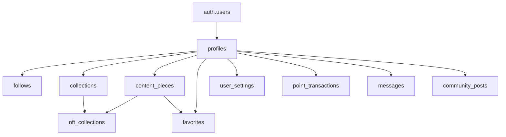

# Technical Architecture Documentation
## RoundAbout Creator Platform

### 🏗️ System Architecture Overview

#### High-Level Architecture
```
┌─────────────────┐    ┌─────────────────┐    ┌─────────────────┐
│   Frontend      │    │   Backend       │    │   External      │
│   React App     │◄──►│   Supabase      │◄──►│   Services      │
│   (Vercel)      │    │   (Cloud)       │    │   (APIs)        │
└─────────────────┘    └─────────────────┘    └─────────────────┘
```

#### Technology Stack
```typescript
Frontend:
- React 18.3.1 (UI Framework)
- TypeScript (Type Safety)
- Vite (Build Tool)
- Tailwind CSS (Styling)
- React Router (Navigation)
- TanStack Query (Data Fetching)

Backend:
- Supabase (BaaS Platform)
- PostgreSQL (Database)
- Row Level Security (Data Security)
- Edge Functions (Serverless)
- Real-time (WebSocket)

External Services:
- Stripe (Payments)
- Social Media APIs (Data Sync)
- Email Service (Notifications)
- CDN (Asset Delivery)
```

### 🗄️ Database Architecture

#### Core Tables Structure
```sql
-- User Management
profiles (id, username, full_name, bio, avatar_url)
user_settings (user_id, preferences, notifications)
follows (follower_id, following_id)

-- Trading/Financial (Legacy - Can be repurposed)
trading_bots → collaboration_bots
portfolios → creator_portfolios  
transactions → point_transactions

-- Content & Community
collections (creator_id, name, description)
nfts → content_pieces (creator_id, title, content_url)
favorites (user_id, content_id)

-- Analytics & Performance  
bot_performance → engagement_performance
alerts → notification_rules
watchlists → content_watchlists

-- Communication
memories → messages
stories → community_posts
```

#### Database Relationships


#### Row Level Security (RLS) Policies
```sql
-- Example RLS Policies
CREATE POLICY "users_view_own_profile" ON profiles
  FOR SELECT USING (auth.uid() = id);

CREATE POLICY "users_update_own_profile" ON profiles  
  FOR UPDATE USING (auth.uid() = id);

CREATE POLICY "public_profiles_readable" ON profiles
  FOR SELECT USING (true);

CREATE POLICY "users_manage_own_content" ON content_pieces
  FOR ALL USING (auth.uid() = creator_id);
```

### 🔧 Backend Services

#### Supabase Edge Functions
```typescript
// Function: check-subscription
export default serve(async (req) => {
  // Verify user subscription status with Stripe
  // Update local subscription cache
  // Return subscription details
})

// Function: create-subscription  
export default serve(async (req) => {
  // Create Stripe checkout session
  // Store session details
  // Return checkout URL
})

// Function: customer-portal
export default serve(async (req) => {
  // Create Stripe customer portal session
  // Return portal URL for subscription management
})

// Function: sync-social-data (To be implemented)
export default serve(async (req) => {
  // Fetch data from social media APIs
  // Process and normalize data
  // Store in database with proper attribution
})
```

#### Real-time Features
```typescript
// Real-time Subscriptions
const channel = supabase
  .channel('notifications')
  .on('postgres_changes', {
    event: 'INSERT',
    schema: 'public',
    table: 'notifications'
  }, payload => {
    // Handle real-time notifications
    updateNotificationCount(payload.new)
  })
  .subscribe()

// Presence Tracking
const presenceChannel = supabase
  .channel('online_users')
  .on('presence', { event: 'sync' }, () => {
    const presenceState = presenceChannel.presenceState()
    updateOnlineUsers(presenceState)
  })
  .subscribe()
```

### 🎨 Frontend Architecture

#### Component Architecture
```
src/
├── components/
│   ├── ui/                 # Shadcn components
│   ├── auth/              # Authentication components
│   ├── dashboard/         # Dashboard components
│   ├── community/         # Community features
│   ├── analytics/         # Charts and metrics
│   ├── engagement/        # Engagement tracking
│   ├── messaging/         # Communication
│   ├── payment/           # Stripe integration
│   └── layout/            # Layout components
├── contexts/              # React Context providers
├── hooks/                 # Custom React hooks
├── pages/                 # Route components
├── lib/                   # Utility functions
└── types/                 # TypeScript definitions
```

#### State Management Strategy
```typescript
// Global State: React Context + useReducer
interface AuthState {
  user: User | null
  session: Session | null
  subscribed: boolean
  subscriptionTier: string | null
}

// Server State: TanStack Query
const useEngagementData = () => {
  return useQuery({
    queryKey: ['engagement', userId],
    queryFn: () => fetchEngagementData(userId),
    staleTime: 5 * 60 * 1000, // 5 minutes
  })
}

// Local State: useState for component-specific state
const [isModalOpen, setIsModalOpen] = useState(false)
```

#### Routing Architecture
```typescript
// Protected Route Wrapper
<Route path="/dashboard" element={
  <ProtectedRoute>
    <Dashboard />
  </ProtectedRoute>
} />

// Nested Routes for Dashboard
<Route path="/dashboard/*" element={<DashboardLayout />}>
  <Route index element={<DashboardHome />} />
  <Route path="engagement" element={<EngagementPage />} />
  <Route path="analytics" element={<AnalyticsPage />} />
  <Route path="community" element={<CommunityPage />} />
</Route>
```

### 🔒 Security Architecture

#### Authentication Flow
```typescript
// Supabase Auth Integration
const signUp = async (email: string, password: string) => {
  const { data, error } = await supabase.auth.signUp({
    email,
    password,
    options: {
      emailRedirectTo: `${window.location.origin}/dashboard`
    }
  })
  return { data, error }
}

// Session Management
useEffect(() => {
  const { data: { subscription } } = supabase.auth.onAuthStateChange(
    (event, session) => {
      setSession(session)
      setUser(session?.user ?? null)
    }
  )
  return () => subscription.unsubscribe()
}, [])
```

#### API Security
```typescript
// Row Level Security in Database
-- Users can only access their own data
CREATE POLICY "user_data_isolation" ON user_data
  FOR ALL USING (auth.uid() = user_id);

-- Public data is readable by all authenticated users  
CREATE POLICY "public_content_readable" ON public_content
  FOR SELECT TO authenticated USING (true);
```

#### Environment Security
```typescript
// Environment Variables (Supabase Secrets)
SUPABASE_URL=https://project.supabase.co
SUPABASE_ANON_KEY=eyJ...
SUPABASE_SERVICE_ROLE_KEY=eyJ... (server-side only)
STRIPE_SECRET_KEY=sk_... (server-side only)
OPENAI_API_KEY=sk-... (server-side only)
```

### 📡 API Architecture

#### RESTful API Design
```typescript
// Supabase Auto-generated REST API
GET    /rest/v1/profiles              # List profiles
GET    /rest/v1/profiles?id=eq.123    # Get specific profile
POST   /rest/v1/profiles              # Create profile
PATCH  /rest/v1/profiles?id=eq.123    # Update profile
DELETE /rest/v1/profiles?id=eq.123    # Delete profile

// Custom Edge Functions
POST   /functions/v1/create-subscription
POST   /functions/v1/check-subscription  
POST   /functions/v1/customer-portal
POST   /functions/v1/sync-social-data
```

#### API Error Handling
```typescript
// Standardized Error Response
interface APIError {
  error: {
    message: string
    code: string
    details?: any
  }
  status: number
}

// Error Handling in Components
const { data, error, isLoading } = useQuery({
  queryKey: ['data'],
  queryFn: fetchData,
  onError: (error: APIError) => {
    toast({
      title: "Error",
      description: error.error.message,
      variant: "destructive"
    })
  }
})
```

### 🚀 Performance Architecture

#### Frontend Optimization
```typescript
// Code Splitting
const AnalyticsPage = lazy(() => import('@/pages/AnalyticsPage'))
const CommunityPage = lazy(() => import('@/pages/CommunityPage'))

// Memoization
const ExpensiveComponent = memo(({ data }) => {
  const computedValue = useMemo(() => {
    return heavyComputation(data)
  }, [data])
  
  return <div>{computedValue}</div>
})

// Virtual Scrolling for Large Lists
<VirtualizedList
  height={400}
  itemCount={items.length}
  itemSize={80}
  renderItem={({ index, style }) => (
    <div style={style}>
      <ItemComponent item={items[index]} />
    </div>
  )}
/>
```

#### Database Optimization
```sql
-- Indexes for Performance
CREATE INDEX idx_profiles_username ON profiles(username);
CREATE INDEX idx_content_creator_id ON content_pieces(creator_id);
CREATE INDEX idx_follows_follower ON follows(follower_id);
CREATE INDEX idx_follows_following ON follows(following_id);

-- Materialized Views for Analytics
CREATE MATERIALIZED VIEW creator_stats AS
SELECT 
  creator_id,
  COUNT(*) as total_content,
  AVG(engagement_rate) as avg_engagement,
  SUM(points_earned) as total_points
FROM content_pieces 
GROUP BY creator_id;
```

#### Caching Strategy
```typescript
// Browser Caching
// Service Worker for static assets
// React Query for API response caching

// Cache Configuration
const queryClient = new QueryClient({
  defaultOptions: {
    queries: {
      staleTime: 5 * 60 * 1000,     // 5 minutes
      cacheTime: 10 * 60 * 1000,    // 10 minutes
      retry: 2,
      refetchOnWindowFocus: false,
    },
  },
})
```

### 📱 Mobile Architecture

#### Responsive Design System
```css
/* Mobile-First Breakpoints */
/* Base: Mobile (0-640px) */
.container { padding: 1rem; }

/* Tablet (641px-1024px) */
@media (min-width: 641px) {
  .container { padding: 2rem; }
}

/* Desktop (1025px+) */
@media (min-width: 1025px) {
  .container { 
    padding: 3rem;
    max-width: 1200px;
    margin: 0 auto;
  }
}
```

#### Progressive Web App Features
```typescript
// Service Worker Registration
if ('serviceWorker' in navigator) {
  navigator.serviceWorker.register('/sw.js')
}

// Offline Functionality
// Push Notifications
// App-like Installation
```

### 🔧 Development Architecture

#### Build Pipeline
```json
// package.json scripts
{
  "dev": "vite",
  "build": "vite build",
  "preview": "vite preview",
  "type-check": "tsc --noEmit",
  "lint": "eslint src/",
  "format": "prettier --write src/"
}
```

#### Environment Configuration
```typescript
// vite.config.ts
export default defineConfig({
  plugins: [react()],
  resolve: {
    alias: {
      "@": path.resolve(__dirname, "./src"),
    },
  },
  build: {
    rollupOptions: {
      output: {
        manualChunks: {
          vendor: ['react', 'react-dom'],
          ui: ['@radix-ui/react-dialog', '@radix-ui/react-select'],
        },
      },
    },
  },
})
```

### 🔍 Monitoring Architecture

#### Error Tracking
```typescript
// Error Boundary
class ErrorBoundary extends Component {
  componentDidCatch(error: Error, errorInfo: ErrorInfo) {
    // Log to monitoring service
    console.error('Application Error:', error, errorInfo)
  }
}

// Console Logging for Development
console.log('User action:', action, 'Data:', data)
```

#### Performance Monitoring
```typescript
// Performance Metrics
const observer = new PerformanceObserver((list) => {
  list.getEntries().forEach((entry) => {
    if (entry.entryType === 'navigation') {
      console.log('Page Load Time:', entry.duration)
    }
  })
})
observer.observe({ entryTypes: ['navigation', 'paint'] })
```

This technical architecture provides a solid foundation for scalability, maintainability, and performance optimization of the RoundAbout platform.
