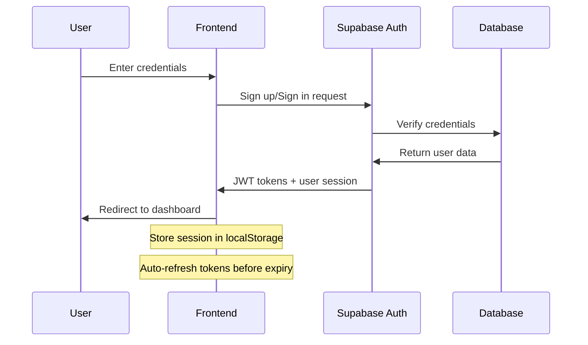

# Authentication & Security Documentation
## RoundAbout Creator Platform

### 🔐 Authentication Architecture

#### Overview
RoundAbout uses Supabase Auth for secure user authentication, providing JWT-based session management with automatic token refresh and secure session persistence.

#### Authentication Flow


### 🔑 Authentication Implementation

#### Supabase Auth Configuration
```typescript
// Client-side authentication setup
export const supabase = createClient<Database>(
  SUPABASE_URL, 
  SUPABASE_PUBLISHABLE_KEY, 
  {
    auth: {
      storage: localStorage,
      persistSession: true,
      autoRefreshToken: true,
    }
  }
);
```

#### Authentication Context
```typescript
interface AuthState {
  user: User | null;
  session: Session | null;
  subscribed: boolean;
  subscriptionTier: string | null;
  loading: boolean;
}

export const AuthProvider: React.FC<{ children: ReactNode }> = ({ children }) => {
  const [state, setState] = useState<AuthState>({
    user: null,
    session: null,
    subscribed: false,
    subscriptionTier: null,
    loading: true,
  });

  useEffect(() => {
    const { data: { subscription } } = supabase.auth.onAuthStateChange(
      async (event, session) => {
        setState(prev => ({
          ...prev,
          session,
          user: session?.user ?? null,
          loading: false,
        }));

        if (session?.user) {
          await checkSubscription();
        }
      }
    );

    return () => subscription.unsubscribe();
  }, []);

  const signUp = async (email: string, password: string, userData?: any) => {
    const { data, error } = await supabase.auth.signUp({
      email,
      password,
      options: {
        data: userData,
        emailRedirectTo: `${window.location.origin}/dashboard`
      }
    });
    return { data, error };
  };

  const signIn = async (email: string, password: string) => {
    const { data, error } = await supabase.auth.signInWithPassword({
      email,
      password
    });
    return { data, error };
  };

  const signOut = async () => {
    const { error } = await supabase.auth.signOut();
    if (!error) {
      setState({
        user: null,
        session: null,
        subscribed: false,
        subscriptionTier: null,
        loading: false,
      });
    }
    return { error };
  };

  const checkSubscription = async () => {
    try {
      const { data, error } = await supabase.functions.invoke('check-subscription');
      if (!error && data) {
        setState(prev => ({
          ...prev,
          subscribed: data.subscribed,
          subscriptionTier: data.subscription_tier,
        }));
      }
    } catch (error) {
      console.error('Error checking subscription:', error);
    }
  };

  return (
    <AuthContext.Provider value={{
      ...state,
      signUp,
      signIn,
      signOut,
      checkSubscription,
    }}>
      {children}
    </AuthContext.Provider>
  );
};
```

#### Protected Routes
```typescript
export const ProtectedRoute: React.FC<{ children: ReactNode }> = ({ children }) => {
  const { user, loading } = useAuth();

  if (loading) {
    return (
      <div className="min-h-screen flex items-center justify-center">
        <div className="animate-spin rounded-full h-32 w-32 border-b-2 border-primary"></div>
      </div>
    );
  }

  if (!user) {
    return <Navigate to="/auth" replace />;
  }

  return <>{children}</>;
};
```

### 🛡️ Row Level Security (RLS)

#### RLS Policy Strategy
All database tables implement Row Level Security to ensure users can only access their own data or publicly available information.

#### User Data Isolation
```sql
-- Profile access control
CREATE POLICY "users_view_own_profile" ON profiles
  FOR SELECT USING (auth.uid() = id);

CREATE POLICY "users_update_own_profile" ON profiles
  FOR UPDATE USING (auth.uid() = id);

CREATE POLICY "public_profiles_readable" ON profiles
  FOR SELECT USING (true);

-- Social accounts - private data
CREATE POLICY "users_manage_own_social_accounts" ON social_accounts
  FOR ALL USING (auth.uid() = user_id);

-- User points and transactions
CREATE POLICY "users_view_own_points" ON user_points
  FOR SELECT USING (auth.uid() = user_id);

CREATE POLICY "users_view_own_transactions" ON point_transactions
  FOR SELECT USING (auth.uid() = user_id);
```

#### Community Data Access
```sql
-- Public content access
CREATE POLICY "public_posts_readable" ON content_posts
  FOR SELECT USING (is_public = true);

-- Group member content access
CREATE POLICY "group_members_view_posts" ON content_posts
  FOR SELECT USING (
    is_public = true OR
    EXISTS(
      SELECT 1 FROM group_members gm 
      WHERE gm.group_id = content_posts.group_id 
      AND gm.user_id = auth.uid()
      AND gm.is_active = true
    )
  );

-- Message privacy
CREATE POLICY "users_view_own_messages" ON messages
  FOR SELECT USING (
    EXISTS(
      SELECT 1 FROM conversations c 
      WHERE c.id = messages.conversation_id 
      AND auth.uid() = ANY(c.participants)
    )
  );
```

### 🔒 Data Security

#### Encryption at Rest
- **Database**: All data encrypted using AES-256 encryption
- **Backups**: Encrypted backups with separate key management
- **Sensitive Fields**: Additional encryption for tokens and payment data

#### Encryption in Transit
```typescript
// All API communications use HTTPS/TLS 1.3
const apiRequest = async (endpoint: string, data: any) => {
  const response = await fetch(`https://api.roundabout.com${endpoint}`, {
    method: 'POST',
    headers: {
      'Content-Type': 'application/json',
      'Authorization': `Bearer ${session.access_token}`,
    },
    body: JSON.stringify(data),
  });
  
  return response.json();
};
```

#### Token Security
```typescript
// JWT token structure and validation
interface JWTPayload {
  sub: string;           // User ID
  email: string;         // User email
  role: string;          // User role
  iat: number;           // Issued at
  exp: number;           // Expiry time
  aud: string;           // Audience
  iss: string;           // Issuer
}

// Automatic token refresh
const refreshToken = async () => {
  const { data, error } = await supabase.auth.refreshSession();
  if (error) {
    // Handle refresh failure - redirect to login
    signOut();
  }
  return data.session;
};
```

### 🔐 Password Security

#### Password Requirements
```typescript
interface PasswordRequirements {
  minLength: 8;
  requireUppercase: true;
  requireLowercase: true;
  requireNumbers: true;
  requireSpecialChars: true;
  preventCommonPasswords: true;
}

const validatePassword = (password: string): ValidationResult => {
  const requirements = {
    length: password.length >= 8,
    uppercase: /[A-Z]/.test(password),
    lowercase: /[a-z]/.test(password),
    numbers: /\d/.test(password),
    special: /[!@#$%^&*(),.?":{}|<>]/.test(password),
  };

  return {
    isValid: Object.values(requirements).every(Boolean),
    requirements,
  };
};
```

#### Password Reset Flow
```typescript
const resetPassword = async (email: string) => {
  const { error } = await supabase.auth.resetPasswordForEmail(email, {
    redirectTo: `${window.location.origin}/auth/reset-password`,
  });

  if (error) {
    throw new Error('Failed to send reset email');
  }

  return { message: 'Password reset email sent' };
};

const updatePassword = async (newPassword: string) => {
  const { error } = await supabase.auth.updateUser({
    password: newPassword
  });

  if (error) {
    throw new Error('Failed to update password');
  }
};
```

### 🚨 Security Monitoring

#### Authentication Monitoring
```typescript
// Track authentication events
const logAuthEvent = (event: string, userId?: string, metadata?: any) => {
  console.log(`[AUTH] ${event}`, {
    userId,
    timestamp: new Date().toISOString(),
    userAgent: navigator.userAgent,
    ip: 'client-side', // Server-side would capture real IP
    metadata,
  });
};

// Monitor failed login attempts
const handleAuthError = (error: AuthError, email: string) => {
  logAuthEvent('login_failed', undefined, {
    email,
    error: error.message,
    errorCode: error.name,
  });

  // Implement rate limiting on client side
  const attempts = getFailedAttempts(email);
  if (attempts >= 5) {
    lockAccount(email, 15); // 15 minute lockout
  }
};
```

#### Security Headers
```typescript
// Security headers configuration (handled by hosting provider)
const securityHeaders = {
  'Strict-Transport-Security': 'max-age=31536000; includeSubDomains',
  'X-Content-Type-Options': 'nosniff',
  'X-Frame-Options': 'DENY',
  'X-XSS-Protection': '1; mode=block',
  'Referrer-Policy': 'strict-origin-when-cross-origin',
  'Content-Security-Policy': `
    default-src 'self';
    script-src 'self' 'unsafe-inline' 'unsafe-eval' https://js.stripe.com;
    style-src 'self' 'unsafe-inline' https://fonts.googleapis.com;
    img-src 'self' data: https: blob:;
    font-src 'self' https://fonts.gstatic.com;
    connect-src 'self' https://*.supabase.co https://api.stripe.com;
    frame-src https://js.stripe.com https://hooks.stripe.com;
  `.replace(/\s+/g, ' ').trim(),
};
```

### 🔒 API Security

#### Edge Function Security
```typescript
// Secure edge function implementation
export default serve(async (req) => {
  // CORS handling
  if (req.method === 'OPTIONS') {
    return new Response(null, { headers: corsHeaders });
  }

  try {
    // Authenticate user
    const authHeader = req.headers.get('Authorization');
    if (!authHeader) {
      throw new Error('Missing authorization header');
    }

    const token = authHeader.replace('Bearer ', '');
    const { data, error } = await supabase.auth.getUser(token);
    
    if (error || !data.user) {
      throw new Error('Invalid or expired token');
    }

    // Rate limiting
    const userKey = `rate_limit:${data.user.id}`;
    const current = await redis.get(userKey) || 0;
    
    if (current >= 100) { // 100 requests per hour
      return new Response('Rate limit exceeded', { status: 429 });
    }
    
    await redis.setex(userKey, 3600, current + 1);

    // Process request
    return handleRequest(req, data.user);
    
  } catch (error) {
    return new Response(
      JSON.stringify({ error: error.message }), 
      { 
        status: 401,
        headers: { 'Content-Type': 'application/json' }
      }
    );
  }
});
```

#### Input Validation & Sanitization
```typescript
// Comprehensive input validation
import { z } from 'zod';

const createProfileSchema = z.object({
  username: z.string()
    .min(3, 'Username must be at least 3 characters')
    .max(30, 'Username must be less than 30 characters')
    .regex(/^[a-zA-Z0-9_]+$/, 'Username can only contain letters, numbers, and underscores'),
  full_name: z.string()
    .min(1, 'Full name is required')
    .max(100, 'Full name must be less than 100 characters')
    .transform(val => val.trim()),
  bio: z.string()
    .max(500, 'Bio must be less than 500 characters')
    .optional()
    .transform(val => val?.trim()),
  avatar_url: z.string().url('Invalid avatar URL').optional(),
});

const validateAndSanitizeInput = (data: unknown, schema: z.ZodSchema) => {
  try {
    return schema.parse(data);
  } catch (error) {
    if (error instanceof z.ZodError) {
      throw new Error(`Validation failed: ${error.errors.map(e => e.message).join(', ')}`);
    }
    throw error;
  }
};
```

### 🔐 Session Management

#### Session Configuration
```typescript
// Session timeout and refresh strategy
const SESSION_CONFIG = {
  accessTokenDuration: 3600, // 1 hour
  refreshTokenDuration: 86400 * 30, // 30 days
  inactivityTimeout: 1800, // 30 minutes
  maxConcurrentSessions: 5,
};

// Auto-logout on inactivity
let inactivityTimer: NodeJS.Timeout;

const resetInactivityTimer = () => {
  clearTimeout(inactivityTimer);
  inactivityTimer = setTimeout(() => {
    signOut();
    showNotification('Session expired due to inactivity');
  }, SESSION_CONFIG.inactivityTimeout * 1000);
};

// Track user activity
document.addEventListener('mousedown', resetInactivityTimer);
document.addEventListener('keypress', resetInactivityTimer);
document.addEventListener('scroll', resetInactivityTimer);
```

#### Multi-Device Session Management
```typescript
// Track active sessions
const trackSession = async (userId: string, deviceInfo: DeviceInfo) => {
  const sessionId = generateUUID();
  
  await supabase.from('user_sessions').insert({
    user_id: userId,
    session_id: sessionId,
    device_info: deviceInfo,
    ip_address: getClientIP(),
    user_agent: navigator.userAgent,
    last_active: new Date(),
  });

  return sessionId;
};

// Revoke session
const revokeSession = async (sessionId: string) => {
  await supabase.from('user_sessions').update({
    revoked_at: new Date(),
    is_active: false,
  }).eq('session_id', sessionId);
};
```

### 🛡️ Security Best Practices

#### Client-Side Security
```typescript
// Prevent XSS attacks
const sanitizeHTML = (html: string): string => {
  const div = document.createElement('div');
  div.textContent = html;
  return div.innerHTML;
};

// Secure localStorage usage
const secureStorage = {
  setItem: (key: string, value: any) => {
    try {
      localStorage.setItem(key, JSON.stringify(value));
    } catch (error) {
      console.error('Failed to store data securely:', error);
    }
  },
  
  getItem: (key: string) => {
    try {
      const item = localStorage.getItem(key);
      return item ? JSON.parse(item) : null;
    } catch (error) {
      console.error('Failed to retrieve data securely:', error);
      return null;
    }
  },
  
  removeItem: (key: string) => {
    localStorage.removeItem(key);
  },
};
```

#### CSRF Protection
```typescript
// CSRF token implementation
const generateCSRFToken = (): string => {
  return crypto.randomUUID();
};

const validateCSRFToken = (token: string, storedToken: string): boolean => {
  return token === storedToken;
};

// Include CSRF token in forms
const secureForm = (formData: FormData) => {
  const csrfToken = generateCSRFToken();
  secureStorage.setItem('csrf_token', csrfToken);
  formData.append('csrf_token', csrfToken);
  return formData;
};
```

### 🔍 Security Auditing

#### Audit Logging
```typescript
// Security event logging
interface SecurityEvent {
  event_type: string;
  user_id?: string;
  ip_address: string;
  user_agent: string;
  timestamp: string;
  metadata?: any;
}

const logSecurityEvent = async (event: SecurityEvent) => {
  await supabase.from('security_logs').insert(event);
};

// Common security events to log
const SECURITY_EVENTS = {
  LOGIN_SUCCESS: 'login_success',
  LOGIN_FAILURE: 'login_failure',
  LOGOUT: 'logout',
  PASSWORD_CHANGE: 'password_change',
  PASSWORD_RESET: 'password_reset',
  ACCOUNT_LOCKED: 'account_locked',
  SUSPICIOUS_ACTIVITY: 'suspicious_activity',
  DATA_EXPORT: 'data_export',
  PERMISSION_CHANGE: 'permission_change',
};
```

#### Security Monitoring Dashboard
```typescript
// Real-time security monitoring
const monitorSecurityEvents = () => {
  const channel = supabase
    .channel('security_events')
    .on('postgres_changes', {
      event: 'INSERT',
      schema: 'public',
      table: 'security_logs',
      filter: 'event_type=in.(login_failure,suspicious_activity)'
    }, (payload) => {
      handleSecurityAlert(payload.new);
    })
    .subscribe();

  return channel;
};

const handleSecurityAlert = (event: SecurityEvent) => {
  // Alert administrators of security events
  if (event.event_type === 'suspicious_activity') {
    notifySecurityTeam(event);
  }
};
```

### 📋 Compliance & Privacy

#### GDPR Compliance
```typescript
// Data export for user rights
const exportUserData = async (userId: string) => {
  const userData = await Promise.all([
    supabase.from('profiles').select('*').eq('id', userId),
    supabase.from('user_points').select('*').eq('user_id', userId),
    supabase.from('point_transactions').select('*').eq('user_id', userId),
    supabase.from('social_accounts').select('platform,username,created_at').eq('user_id', userId),
  ]);

  return {
    exported_at: new Date().toISOString(),
    user_id: userId,
    data: userData,
  };
};

// Data deletion for right to be forgotten
const deleteUserData = async (userId: string) => {
  // Cascade delete will handle most relationships
  await supabase.auth.admin.deleteUser(userId);
  
  // Log deletion for compliance
  await logSecurityEvent({
    event_type: 'data_deletion',
    user_id: userId,
    ip_address: getClientIP(),
    user_agent: navigator.userAgent,
    timestamp: new Date().toISOString(),
  });
};
```

This comprehensive security documentation ensures the RoundAbout platform maintains the highest standards of user data protection and system security.
